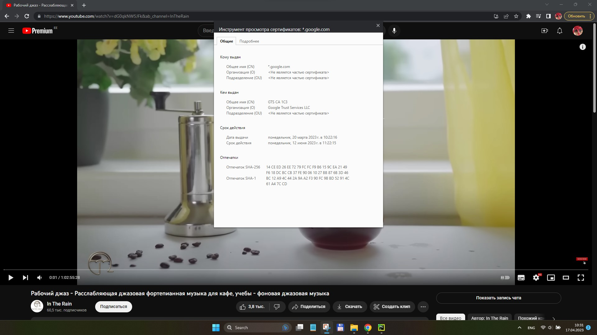
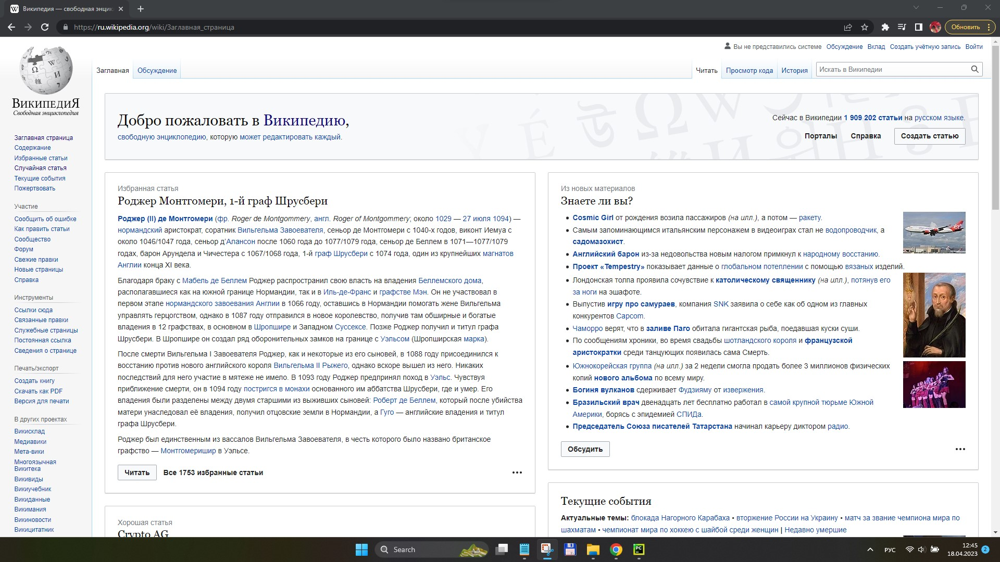
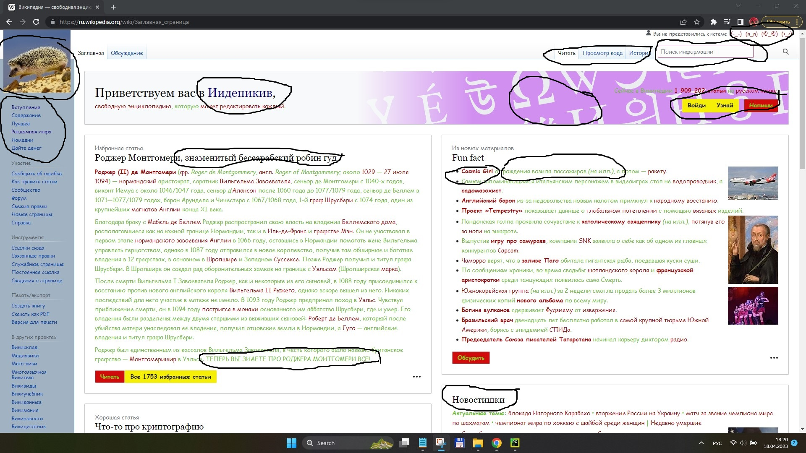
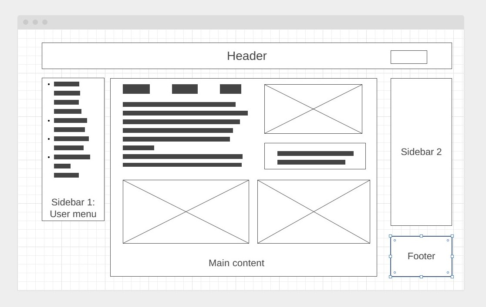

### 1
Сайт youtube.com работает на протоколе HTTPS это видно в адресной строке(замок), также это видно в доменном имени сайта https://www.youtube.com/. Также, если нажать на этот выпадает окошко где написано "Безопасное подключение", нажав на которое можно узнать информацию о сертификате безопасности (версию, серийный номер, срок действия и тд)

### 2
Страница  https://ru.wikipedia.org/ состоит из нескольких блоков:
* Слева располагается несколько меню:
Первое позволяет перемещаться между статьями расположенными на главной странице.
Второе  позволяет привить страницу, сообщать об ошибке, перейти на форум, получить справку и тд
Третье меню “инструменты” позволяет писать статьи, делать ссылки и тд
Четвертое позволяет создать, распечатать информацию
Пятое меню представляет собой список сторонних сайтов, связанных с Википедией. Эти же названия в виде кликабельных иконок дублируются в подвале сайта
Шестое меню содержит обширный список языков и перевести сайт на иностранный язык.
* Над шапкой находится поисковая строка и несколько вкладок “Заглавная,” ”Обсуждение”, “Читать”, “Просмотр кода”, “История”
*  наверху располагается шапка с логотипом на фоне, приветствием и 3 кнопками меню  - “портал”, “Справка” и “Создать”
* Тело страницы состоит из нескольких блоков, расположенных слева и справа. Названия блоков дублируют названия разделов из меню, расположенного в верхней левой части страницы. Блоки содержат статьи со ссылками и картинки. Внизу каждого блока есть кнопка “Читать” и ссылка на избранные статьи.
Названия нижних четырех блоков не повторяются в боковом меню и представляют собой: информацию как-то связанную с сегодняшним днем - картинка дня, краткие новости, краткую историческую справку про сегодняшний день, а также приглашение принять участие в написании определенных статей.
* В подвале расположен список иконок связанных с википедией сайтов - Викисловарь, Викисклад, Викиучебник и тд
### 3
На заглавной странице  https://ru.wikipedia.org/ я поменяла шрифт, цвет текста - основной текст зеленого цвета, а гиперссылки красным. Поменяла некоторые заголовки, верхнее меню слева, поменяла логотип, фон, рамку поиска, текст и кнопки в шапке, меню в самом верху шапки, еще текст в разделе “Новостишки” но он не влез в скриншот
 
[Было](3_before.jpg) [Стало](3_after.jpg)

### 4 
Прототип низкой детализации - сверху шапка под которой находятся слева логотип, справа иконки меню.
Под шапкой располагается зона контента разделенная на блоки, сначал на 2 колонки, а потом блоки располагаются один под другим. 
Слева располагается меню пользователя в виде иконок. Когда прокручиваешь страницу вниз справа появляется закрепленная панель, в которой содержатся новости.
Подвал появляется в нижнем правом углу когда скролишь страницу вниз. 

